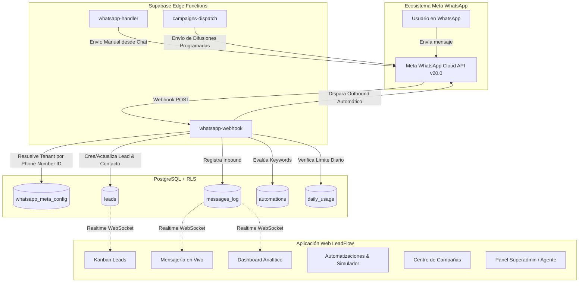

# Análisis Integral de Arquitectura y Funcionamiento: LeadFlow Ultra (CRM WhatsApp Meta Cloud API)

---

## 1. Resumen Ejecutivo y Propósito del Proyecto

**LeadFlow Ultra** es una plataforma **SaaS CRM Multi-Inquilino (Multi-tenant) de Marca Blanca** diseñada para la captación, automatización, gestión y monetización de ventas a través de la **API Oficial de WhatsApp Cloud de Meta (Graph API v20.0)**.

El sistema permite aislar completamente la información de cada empresa/cliente (leads, contactos, configuraciones, automatizaciones y mensajes) mediante políticas de seguridad a nivel de fila (**PostgreSQL Row Level Security - RLS**), a la vez que proporciona paneles especializados de **Superadministrador** y **Revendedor/Agente** para escalar el modelo de negocio SaaS.

---

## 2. Pila Tecnológica (Tech Stack)

### 2.1. Frontend
- **Framework & Core**: [React 19](https://react.dev/) + [TypeScript](https://www.typescriptlang.org/)
- **Enrutador**: [@tanstack/react-router](https://tanstack.com/router) (Enrutamiento tipado basado en archivos)
- **Gestor de Estado y Consultas**: [@tanstack/react-query](https://tanstack.com/query)
- **Estilos y Diseño**: [Tailwind CSS v4](https://tailwindcss.com/) + CSS Variables Oklch
- **Componentes UI**: [Radix UI](https://www.radix-ui.com/) (primitivas accesibles) + [Shadcn UI](https://ui.shadcn.com/)
- **Animaciones e Interacciones**: [Framer Motion](https://www.framer.com/motion/) + `@dnd-kit/core` & `@dnd-kit/sortable` (Drag & Drop en Kanban)
- **Métricas y Gráficos**: [Recharts](https://recharts.org/)
- **Notificaciones**: [Sonner](https://sonner.emilkowal.ski/)
- **Bundler & Build Tool**: [Vite](https://vitejs.dev/)

### 2.2. Backend & Base de Datos (BaaS)
- **Supabase**:
  - **PostgreSQL 15+**: Base de datos relacional con RLS estricto, funciones PL/pgSQL y extensiones (`pg_cron`, `pg_net`).
  - **Supabase Auth**: Autenticación por email/contraseña, flujo de invitaciones y verificación de correo.
  - **Supabase Realtime**: Suscripciones WebSocket para actualización en vivo de chats, leads y estadísticas.
  - **Supabase Edge Functions (Deno runtime)**: Microservicios serverless para la interacción con Meta, webhooks, despachador de campañas y administración de usuarios.

---

## 3. Estructura de Directorios del Proyecto

```plaintext
crm-leadflow-meta/
├── .env                                # Variables de entorno locales
├── package.json                        # Dependencias y scripts del proyecto
├── tsconfig.json                       # Configuración de TypeScript
├── vite.config.ts                      # Configuración de compilación Vite y plugins
├── wrangler.jsonc                      # Configuración de despliegue Cloudflare / Nitro
├── public/                             # Recursos estáticos (favicons, manifest, etc.)
│
├── src/
│   ├── components/                     # Componentes React reutilizables
│   │   ├── layout/
│   │   │   └── AppLayout.tsx           # Sidebar, navegación global, header y footer
│   │   ├── ui/                         # Primitivas de Shadcn UI (button, dialog, etc.)
│   │   ├── EmailVerificationGate.tsx   # Control de acceso por verificación de email
│   │   └── SuspensionGuard.tsx         # Bloqueo de interfaz si la organización está suspendida
│   │
│   ├── hooks/                          # Custom Hooks
│   │   └── use-mobile.tsx              # Detección de dispositivos móviles
│   │
│   ├── integrations/supabase/          # Conexión y tipos de Supabase
│   │   ├── client.ts                   # Instancia del cliente Supabase Browser
│   │   ├── client.server.ts            # Cliente Supabase para SSR / Edge
│   │   ├── auth-middleware.ts          # Validaciones de sesión
│   │   └── types.ts                    # Definiciones TypeScript autogeneradas de la BD
│   │
│   ├── lib/                            # Utilidades y Lógica de Negocio Compartida
│   │   ├── auth-context.tsx            # Proveedor de autenticación, rol y organización activa
│   │   ├── messages-cache.ts           # Caché local (IndexedDB/Storage) para optimizar el chat
│   │   ├── use-daily-usage.ts          # Hook para cálculo y control de cuotas diarias por plan
│   │   └── utils.ts                    # Helpers de formato de clases (clsx, tailwind-merge)
│   │
│   ├── routes/                         # Vistas / Rutas de TanStack Router
│   │   ├── __root.tsx                  # Envoltorio raíz con QueryClient y Toaster
│   │   ├── _app.tsx                    # Layout protegido para usuarios autenticados
│   │   ├── _app.dashboard.tsx          # Panel de métricas analíticas y consumo diario
│   │   ├── _app.whatsapp.tsx           # WhatsApp Hub (Credenciales Meta & Webhook)
│   │   ├── _app.leads.tsx              # Tablero Kanban con Drag & Drop y Drawer de Lead
│   │   ├── _app.contacts.tsx           # Directorio de contactos y gestión de etiquetas
│   │   ├── _app.automations.tsx        # Motor de autorrespuestas y Simulador iPhone
│   │   ├── _app.campaigns.tsx          # Gestor de envíos masivos y difusiones programadas
│   │   ├── _app.messages.tsx           # Bandeja de mensajería bidireccional en tiempo real
│   │   ├── _app.errors.tsx             # Visor de logs y diagnóstico de errores devueltos por Meta
│   │   ├── _app.superadmin.tsx         # Panel maestro para control de clientes, planes y servidor
│   │   ├── _app.agent.tsx              # Panel de revendedor para registrar y gestionar sub-clientes
│   │   ├── index.tsx                   # Landing page / Redirección inteligente
│   │   ├── login.tsx                   # Inicio de sesión
│   │   ├── signup.tsx                  # Registro de nuevas cuentas con auto-aprovisionamiento
│   │   ├── reset-password.tsx          # Recuperación de contraseñas
│   │   ├── accept-invite.tsx           # Aceptación de invitaciones para nuevos usuarios
│   │   └── legal.tsx                   # Términos, condiciones y políticas de privacidad
│   │
│   ├── routeTree.gen.ts                # Árbol de rutas generado automáticamente
│   └── styles.css                      # Variables de diseño (Glassmorphism, Dark Mode, Glows)
│
└── supabase/
    ├── config.toml                     # Configuración del entorno Supabase CLI
    ├── migrations/                     # 40 migraciones SQL con esquemas, funciones y políticas RLS
    └── functions/                      # Edge Functions en Deno
        ├── whatsapp-handler/           # Envío de mensajes hacia la Graph API de Meta
        ├── whatsapp-webhook/           # Recepción de webhooks, enrutamiento multi-tenant y respuestas
        ├── campaigns-dispatch/         # Procesamiento cron de campañas masivas
        ├── admin-users/                # Invitación y eliminación segura de usuarios (Superadmin/Agent)
        └── meta-test/                  # Diagnóstico en vivo de conexión con los servidores de Meta
```

---

## 4. Arquitectura de Datos y Seguridad (Supabase SQL + RLS)

### 4.1. Tablas Principales

| Tabla | Propósito | Columnas Clave |
| :--- | :--- | :--- |
| `organizations` | Cuentas aisladas (Inquilinos/Tenants). | `id`, `name`, `plan_type` (`trial`, `vip`, `pro`, `elite`), `status` (`active`, `suspended`). |
| `profiles` | Perfiles de usuario vinculados a `auth.users`. | `id`, `user_id`, `org_id`, `full_name`, `avatar_url`. |
| `user_roles` | Asignación de roles de seguridad. | `user_id`, `role` (`superadmin`, `client_admin`, `agent`). |
| `agent_clients` | Vinculación entre un Revendedor y las organizaciones de sus clientes. | `id`, `agent_user_id`, `org_id`. |
| `whatsapp_meta_config`| Credenciales de WhatsApp Cloud API por organización. | `org_id`, `phone_number_id`, `waba_id`, `access_token`, `verify_token`. |
| `leads` | Oportunidades comerciales para el Kanban. | `id`, `org_id`, `name`, `phone`, `email`, `status` (`nuevo`, `interesado`, `cliente`, `perdido`), `tags`, `notes`. |
| `contacts` | Directorio maestro de contactos de la empresa. | `id`, `org_id`, `name`, `phone`, `email`, `tags`, `notes`. |
| `automations` | Reglas de respuesta automática por coincidencia de palabras clave. | `id`, `org_id`, `trigger_keyword`, `response_text`, `media_url`, `link_regalo`, `tag_to_apply`, `is_active`. |
| `campaigns` | Campañas masivas de difusión. | `id`, `org_id`, `name`, `message_body`, `audience_type`, `schedule_time`, `status`, `total_leads`, `sent_count`. |
| `messages_log` | Historial auditado de mensajes entrantes y salientes. | `id`, `org_id`, `recipient`, `direction` (`inbound`, `outbound`), `content`, `status`, `provider_message_id`. |
| `meta_errors` | Registro de rechazos o fallos devueltos por la API de Meta. | `id`, `org_id`, `recipient`, `error_code`, `error_title`, `error_detail`, `raw`. |
| `webhook_logs` | Auditoría de tráfico crudo entrante al Webhook. | `id`, `org_id`, `event`, `from_number`, `processing_result`, `raw_payload`. |
| `daily_usage` | Control de consumo diario de mensajes para aplicar límites de plan. | `org_id`, `usage_date`, `message_count`. |

### 4.2. Modelo de Seguridad Multi-Tenant (RLS)
Todas las tablas operativas contienen una clave foránea `org_id` referenciando a `organizations.id`. Las políticas de **Row Level Security (RLS)** evalúan la función `get_user_org_id(auth.uid())` para asegurar que un usuario únicamente pueda consultar, crear, modificar o borrar registros de su propia organización. Los `superadmin` tienen políticas de bypass para tareas de auditoría y soporte global.

---

## 5. Funcionamiento de los Módulos Principales



### 5.1. Dashboard Analítico (`/_app/dashboard`)
- **Métricas en tiempo real**: Conteo total de leads, conversiones del día (leads promovidos a estado `cliente`), mensajes automáticos enviados y estado de conexión de Meta.
- **Gráfica de Crecimiento**: `AreaChart` interactivo de Recharts con el volumen de leads generados en los últimos 7 días.
- **Barra de Cuota Diaria**: Muestra el consumo del día actual frente al límite del plan contratado (ej. 100 mensajes en Trial, 500 en Pro, ilimitado en Elite).

### 5.2. WhatsApp Hub (`/_app/whatsapp`)
- **Gestión de Credenciales**: Formulario para vincular `phone_number_id`, `waba_id`, `access_token` y `verify_token`.
- **Integración de Webhook**: Generación dinámica de la `Callback URL` con el parámetro de la organización (`?org_id=...`) y botón para copiar token de verificación.
- **Herramientas de Diagnóstico**:
  - Botón de **"Enviar prueba"**: Ejecuta `whatsapp-handler` hacia un número real.
  - Botón de **"Probar recepción en el CRM"**: Simula una llamada webhook local para verificar la inserción en la base de datos y suscripción Realtime.

### 5.3. Chat y Mensajería Unificada (`/_app/messages`)
- **Bandeja de Entrada en Tiempo Real**: Lista de conversaciones activas ordenadas por la fecha del último mensaje entrante o saliente.
- **Arquitectura Cache-First**: Los mensajes se leen inicialmente de una caché local en el navegador (`messages-cache.ts`) y se sincronizan incrementalmente (delta sync) con Supabase para ofrecer una carga instantánea.
- **Panel Lateral de Detalles**: Edición rápida de notas del contacto, asignación de tags y cambio de etapa del lead sin salir de la conversación.

### 5.4. Tablero Kanban de Leads (`/_app/leads`)
- **Columnas de Embudo**: *Nuevo*, *Interesado*, *Cliente*, *Perdido*.
- **Drag & Drop Fluido**: Construido con `@dnd-kit`, actualizando el estado del lead de forma optimista y persistiendo el cambio en PostgreSQL.
- **Drawer de Historial**: Al presionar una tarjeta, se despliega un panel con el historial completo de mensajes y notas asociadas.

### 5.5. Automatizaciones y Simulador de iPhone (`/_app/automations`)
- **Algoritmo de Coincidencia Inteligente**: Evalúa los mensajes entrantes por límite de palabras completas (`word boundary`) para evitar falsos positivos (por ejemplo, evita que la keyword "ia" se dispare al escribir "gracias"). Si varias reglas coinciden, se prioriza la de mayor longitud/especificidad.
- **Variables Dinámicas**: Reemplazo de etiquetas como `{nombre}` o `{nombre_cliente}` por el primer nombre del remitente.
- **Auto-Tagging**: Posibilidad de asociar una etiqueta automática al lead cuando activa una palabra clave específica.
- **Simulador Interactivo**: Mockup realista de un iPhone 15 Pro Max que renderiza en tiempo real el mensaje, imágenes y botones tal como los verá el usuario final en WhatsApp.

### 5.6. Centro de Campañas Masivas (`/_app/campaigns`)
- **Segmentación Flexible**: Permite enviar a leads por etiquetas (`target_tags`), contactos seleccionados manualmente o lista de números directos.
- **Programación de Horarios**: Soporte para envíos inmediatos o programados a futuro en la zona horaria local del usuario.
- **Control Anti-Spam y Resiliencia**:
  - Pausa de seguridad de 5 segundos entre cada mensaje enviado.
  - Gestión de presupuesto de tiempo (timeout budget de ~50s en Edge Functions): si la campaña es grande, guarda el cursor `sent_count` y se reanuda en el siguiente ciclo del cron sin duplicar mensajes.

### 5.7. Panel Superadmin (`/_app/superadmin`)
- **Control Global de Cuentas**: Lista todas las organizaciones, permitiendo activar, suspender o cambiar planes (`trial`, `vip`, `pro`, `elite`).
- **Eliminación en Cascada**: RPC `admin_delete_user` que purga de forma segura datos relacionados antes de eliminar la identidad en `auth.users`.
- **Visor de Tráfico de Webhooks**: Monitor estilo consola para depurar payloads crudos recibidos desde Meta.

### 5.8. Panel de Revendedor / Agente (`/_app/agent`)
- Permite a usuarios con rol `agent` aprovisionar sub-cuentas de clientes mediante invitaciones automáticas por correo electrónico (`auth.admin.inviteUserByEmail`), asignando planes y controlando su estado de activación.

---

## 6. Flujo de Trabajo y Ciclo de Vida del Mensaje

1. **Recepción (Inbound)**:
   - Meta envía un `POST` al Edge Function `whatsapp-webhook`.
   - La función extrae el `phone_number_id` y localiza a qué organización (`org_id`) pertenece.
   - Crea o actualiza automáticamente el registro del remitente en las tablas `leads` y `contacts`.
   - Inserta el mensaje en `messages_log` con estado `received`.
   - Busca en `automations` de esa organización si alguna palabra clave coincide.
   - Si coincide y el plan tiene cuota disponible (`daily_usage`), despacha la respuesta a través de la API Graph de Meta y registra el mensaje saliente.

2. **Envío Manual (Outbound)**:
   - El operador escribe en `_app.messages.tsx` y pulsa "Enviar".
   - Se invoca la función `whatsapp-handler`.
   - Se valida la existencia del token y teléfono de la organización.
   - Se incrementa el contador en `daily_usage`.
   - Se hace la llamada HTTP `POST` a `https://graph.facebook.com/v20.0/{phone_number_id}/messages`.
   - Se guarda el `provider_message_id` en `messages_log`. Si Meta devuelve error (ej. ventana de 24h cerrada `131047`), se registra en `meta_errors` y se notifica al usuario en la interfaz.

---

## 7. Instrucciones de Despliegue y Configuración Local

### 7.1. Requisitos Previos
- [Node.js](https://nodejs.org/) v18+ o [Bun](https://bun.sh/)
- Cuenta en [Supabase](https://supabase.com/) con un proyecto activo.
- Cuenta de desarrollador en [Meta for Developers](https://developers.facebook.com/) con una app de WhatsApp configurada.

### 7.2. Configuración de Variables de Entorno (`.env`)
```env
VITE_SUPABASE_URL=https://tu-proyecto.supabase.co
VITE_SUPABASE_ANON_KEY=tu-anon-key
```

### 7.3. Variables en Supabase Edge Functions (Secrets)
```bash
supabase secrets set SUPABASE_URL=https://tu-proyecto.supabase.co
supabase secrets set SUPABASE_SERVICE_ROLE_KEY=tu-service-role-key
```

### 7.4. Ejecución en Desarrollo
```bash
npm install
npm run dev
```
La aplicación estará disponible localmente en `http://localhost:5173`.
