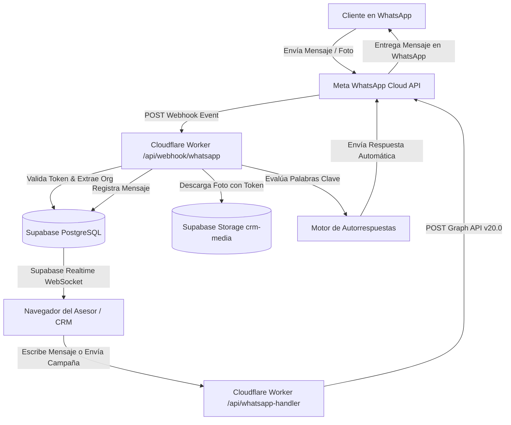

# Análisis Integral de Arquitectura y Funcionamiento: LeadFlow Ultra (CRM WhatsApp Meta Cloud API)

---

## 1. Resumen Ejecutivo y Propósito del Proyecto

**LeadFlow Ultra** es una plataforma **SaaS CRM Multi-Inquilino (Multi-tenant) de Marca Blanca** diseñada para la captación, automatización, gestión y monetización de ventas a través de la **API Oficial de WhatsApp Cloud de Meta (Graph API v20.0)**.

El sistema permite aislar completamente la información de cada empresa/cliente (leads, contactos, configuraciones, automatizaciones, mensajes y multimedia) mediante políticas de seguridad a nivel de fila (**PostgreSQL Row Level Security - RLS**), a la vez que proporciona paneles especializados de **Superadministrador** y **Revendedor/Agente** para escalar el modelo de negocio SaaS sin costos de intermediarios.

---

## 2. Pila Tecnológica (Tech Stack)

### 2.1. Frontend
- **Framework & Core**: [React 19](https://react.dev/) + [TypeScript](https://www.typescriptlang.org/)
- **Enrutador**: [@tanstack/react-router](https://tanstack.com/router) (Enrutamiento tipado basado en archivos)
- **Gestor de Estado y Consultas**: [@tanstack/react-query](https://tanstack.com/query)
- **Estilos y Diseño**: [Tailwind CSS v4](https://tailwindcss.com/) + CSS Variables Oklch
- **Componentes UI**: [Radix UI](https://www.radix-ui.com/) (primitivas accesibles) + [Shadcn UI](https://ui.shadcn.com/)
- **Animaciones e Interacciones**: [Framer Motion](https://www.framer.com/motion/) + `@dnd-kit/core` & `@dnd-kit/sortable` (Drag & Drop en Kanban)
- **Métricas y Gráficos**: [Recharts](https://recharts.org/)
- **Notificaciones**: [Sonner](https://sonner.emilkowal.ski/)
- **Bundler & Build Tool**: [Vite](https://vitejs.dev/) + [Nitro](https://nitro.unjs.io/)

### 2.2. Backend & Motor Serverless (Edge Runtime)
- **Cloudflare Workers (Nitro Engine)**:
  - Microservicios de baja latencia desplegados en el Edge global de Cloudflare.
  - Endpoints dedicados para Webhooks de Meta, despacho de mensajes, campañas masivas, sincronización de perfil comercial y administración de usuarios.
- **Supabase (PostgreSQL 15+)**:
  - **Base de Datos Relacional**: Aislamiento multi-tenant estricto mediante RLS, triggers automáticos y funciones PL/pgSQL.
  - **Supabase Auth**: Autenticación segura por email/contraseña, recuperación y asignación de roles.
  - **Supabase Realtime**: Suscripciones WebSocket para actualización instantánea de chats, leads y estadísticas.
  - **Supabase Storage**: Bucket público `crm-media` para fotos de perfil, imágenes de chat y adjuntos multimedia.

---

## 3. Estructura de Directorios del Proyecto

```plaintext
crm-leadflow-meta/
├── .env                                # Variables de entorno locales
├── package.json                        # Dependencias y scripts del proyecto
├── tsconfig.json                       # Configuración de TypeScript
├── vite.config.ts                      # Configuración de Vite con handlers de Nitro para Cloudflare
├── wrangler.jsonc                      # Configuración de despliegue Cloudflare Workers
├── public/                             # Recursos estáticos (favicons, manifest, etc.)
│
├── server/                             # Endpoints de Backend Nativos (Nitro / Cloudflare)
│   └── routes/
│       ├── api/
│       │   ├── webhook/whatsapp.ts     # Recepción de Webhooks, respuestas y descarga de medios
│       │   ├── whatsapp-handler.ts     # Envío de mensajes y multimedia a Meta Graph API
│       │   ├── campaigns-dispatch.ts   # Despachador de campañas masivas
│       │   ├── whatsapp-profile.ts     # Sincronización de foto y perfil comercial en Meta
│       │   ├── meta-test.ts            # Diagnóstico de salud y calidad de conexión en Meta
│       │   └── admin-users.ts          # Gestión administrativa de usuarios y roles
│       └── functions/                  # Alias de compatibilidad retroactiva
│
├── src/
│   ├── components/                     # Componentes React reutilizables
│   │   ├── layout/
│   │   │   └── AppLayout.tsx           # Sidebar interactivo, navegación global, header y tema
│   │   ├── ui/                         # Primitivas de Shadcn UI (button, dialog, tabs, etc.)
│   │   ├── EmailVerificationGate.tsx   # Control de acceso por verificación de email
│   │   └── SuspensionGuard.tsx         # Bloqueo de interfaz si la organización está suspendida
│   │
│   ├── hooks/                          # Custom Hooks
│   │   └── use-mobile.tsx              # Detección de dispositivos móviles
│   │
│   ├── integrations/supabase/          # Conexión y tipos de Supabase
│   │   ├── client.ts                   # Instancia del cliente Supabase Browser
│   │   ├── client.server.ts            # Cliente Supabase para SSR / Edge
│   │   ├── auth-middleware.ts          # Validaciones de sesión
│   │   └── types.ts                    # Definiciones TypeScript autogeneradas de la BD
│   │
│   ├── lib/                            # Utilidades y Lógica de Negocio Compartida
│   │   ├── auth-context.tsx            # Proveedor de autenticación, rol y organización activa
│   │   ├── functions.ts                # Helper invokeFunction para llamadas directas al backend
│   │   ├── messages-cache.ts           # Caché local para optimizar el chat
│   │   ├── use-daily-usage.ts          # Hook para control de cuotas diarias por plan
│   │   └── utils.ts                    # Helpers de formato de clases (clsx, tailwind-merge)
│   │
│   ├── routes/                         # Vistas / Rutas de TanStack Router
│   │   ├── __root.tsx                  # Envoltorio raíz con QueryClient y Toaster
│   │   ├── _app.tsx                    # Layout protegido para usuarios autenticados
│   │   ├── _app.dashboard.tsx          # Panel de métricas analíticas y consumo diario
│   │   ├── _app.profile.tsx            # Mi Perfil CRM & Perfil Comercial de WhatsApp en Meta
│   │   ├── _app.whatsapp.tsx           # WhatsApp Hub (Diagnóstico, credenciales y webhook)
│   │   ├── _app.leads.tsx              # Tablero Kanban con Drag & Drop y Drawer de Lead
│   │   ├── _app.contacts.tsx           # Directorio de contactos y gestión de etiquetas
│   │   ├── _app.groups.tsx             # Gestor y rotador de enlaces de comunidades WhatsApp
│   │   ├── _app.automations.tsx        # Motor de autorrespuestas y Simulador iPhone
│   │   ├── _app.campaigns.tsx          # Gestor de envíos masivos y difusiones programadas
│   │   ├── _app.messages.tsx           # Bandeja de mensajería bidireccional en tiempo real
│   │   ├── _app.errors.tsx             # Visor de logs y diagnóstico de errores devueltos por Meta
│   │   ├── _app.superadmin.tsx         # Panel maestro para control de clientes, planes y servidor
│   │   ├── _app.agent.tsx              # Panel de revendedor para registrar y gestionar sub-clientes
│   │   ├── index.tsx                   # Landing page / Redirección inteligente
│   │   ├── login.tsx                   # Inicio de sesión
│   │   ├── signup.tsx                  # Registro de nuevas cuentas con auto-aprovisionamiento
│   │   ├── reset-password.tsx          # Recuperación de contraseñas
│   │   ├── accept-invite.tsx           # Aceptación de invitaciones para nuevos usuarios
│   │   └── legal.tsx                   # Términos, condiciones y políticas de privacidad
│   │
│   ├── routeTree.gen.ts                # Árbol de rutas generado automáticamente
│   └── styles.css                      # Variables de diseño (Glassmorphism, Dark Mode, Glows)
│
└── supabase/
    └── migrations/                     # Esquemas SQL completos con tablas, funciones y RLS
```

---

## 4. Flujo de Datos y Conexión con Meta Cloud API



---

## 5. Módulos Principales del CRM

1. **Dashboard & Analíticas**: Resumen de leads calificados, mensajes enviados, tasa de conversión y consumo de cuota diaria según el plan contratado (Trial, VIP, PRO, Elite).
2. **Mi Perfil & WhatsApp Meta Profile**:
   - Gestión de cuenta de usuario, nombre, avatar y contraseña.
   - Sincronización bidireccional con Meta Graph API: cambio de foto oficial de WhatsApp Business, nombre visible (Display Name), estado comercial ("About"), descripción, correo, web y categoría.
3. **WhatsApp Hub**: Conexión multi-tenant de números de teléfono, verificación en tiempo real de salud (`GREEN`), comprobación de tokens y generación automática de URLs de Webhook.
4. **Mensajería en Tiempo Real (Chat Hub)**: Interfaz fluida estilo WhatsApp Web con soporte de texto, imágenes entrantes/salientes, notas internas, cambio de estado de leads y búsqueda rápida.
5. **Leads & Kanban**: Pipeline visual por etapas (Nuevo, Contactado, Negociación, Ganado, Perdido) con arrastrar y soltar (Drag & Drop) y vista detallada de historial.
6. **Automatizaciones & Bot**: Creación de reglas de respuesta instantánea por palabras clave con coincidencia exacta o parcial y simulador de previsualización en vivo.
7. **Campañas Masivas**: Segmentación por etiquetas, envíos directos personalizados y control de pausas para proteger la reputación del número.
8. **Grupos & Comunidades**: Repositorio de links de grupos con distribución automática para captación masiva.
9. **Panel Superadmin & Revendedor (Agent)**: Control global de licencias, creación de organizaciones, límites de uso y monetización de marca blanca.
